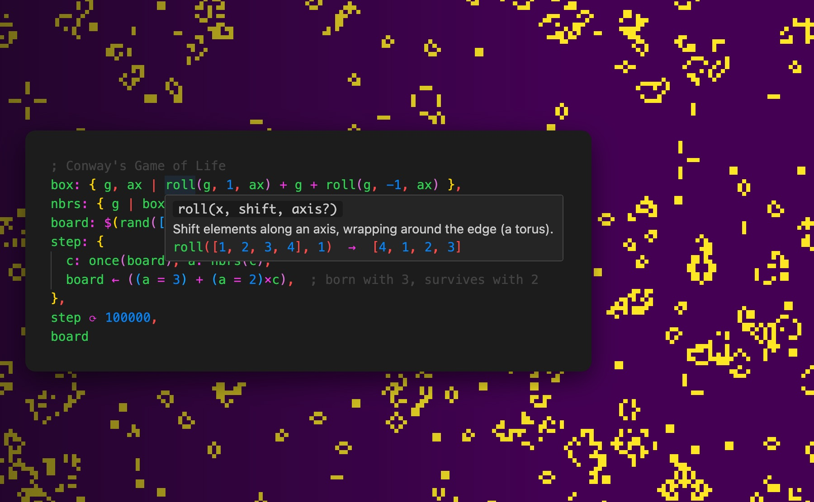

# 🌊 Fluent

**Reactive programming for differentiable tensors.**

Fluent is a tiny language + IDE for people who like to tinker with math — plots, simulations, little machines that learn. You write plain expressions; they render, move, and differentiate as you type.

**[▶ Open the playground](https://mlajtos.github.io/fluent/)** — nothing to install, and it's fast: your GPU does the work, right in the browser.

[](https://mlajtos.github.io/fluent/?example=game-of-life)

[**▶ run this**](https://mlajtos.github.io/fluent/?example=game-of-life) — every snippet in this README is a link that opens live in the playground.

<!-- code fences say "clojure" because GitHub already has a language named
     Fluent (Mozilla's FTL) and paints ours as errors; clojure is the nearest
     look-alike (; comments, brackets, numbers) -->

## Why it feels different

- **Reading order is meaning.** There is no precedence table: spaced operators run left-to-right, glued ones bind tighter — that's the whole story. Code you've never seen evaluates the way you read it, pieces compose without surprises, and any glyph can become an operator of your own.
- **Everything is differentiable.** `∇` works on any function, including ones you just wrote. Higher-order too: `∇(∇(f))`.
- **Everything is reactive.** Drag a slider and exactly the expressions that depend on it re-run — nothing else, nothing forgotten.
- **Results are visible by default.** Tensors render as plots, heatmaps, and images; the AST renders as a tree; there is no `print`.

## See it do things

| | demo | |
|---|---|---|
| 🌀 | **Mandelbrot** — the whole plane iterated at once with `⍣`; scrub the depth | [▶&nbsp;run](https://mlajtos.github.io/fluent/?example=mandelbrot) |
| 🦠 | **Game of Life** on a 256² torus — three lines of rules | [▶&nbsp;run](https://mlajtos.github.io/fluent/?example=game-of-life) |
| 🔮 | **The Name Dreamer** — a 12k-parameter transformer trains live in your tab and invents names; edit the corpus, drag the temperature | [▶&nbsp;run](https://mlajtos.github.io/fluent/?example=dreamer) |
| 🐦 | **Combinators** — the songbirds of tacit programming; `∘ ⍨ ⍥ Φ ⊸ ⟜ ⊢ ⊣` as a field guide, each read left-to-right | [▶&nbsp;run](https://mlajtos.github.io/fluent/?example=combinators) |
| 📷 | **Live edge detection** — your camera through a Laplacian kernel | [▶&nbsp;run](https://mlajtos.github.io/fluent/?example=camera-edges) |
| 🎵 | **Live spectrum** of your microphone — whistle and watch the peak move | [▶&nbsp;run](https://mlajtos.github.io/fluent/?example=spectrum) |
| 🎸 | **Pitch detector** — hum a note, it tells you which one | [▶&nbsp;run](https://mlajtos.github.io/fluent/?example=pitch-detector) |
| 📈 | **Linear regression** — fit a line by gradient descent, loss falling live | [▶&nbsp;run](https://mlajtos.github.io/fluent/?example=linear-regression) |
| 🏔 | **Touch the loss landscape** — grab the ball, drag the learning rate, watch gradient descent roll | [▶&nbsp;run](https://mlajtos.github.io/fluent/?example=loss-landscape) |
| ⚔️ | **adam vs sgd** race down Himmelblau — same start, different characters | [▶&nbsp;run](https://mlajtos.github.io/fluent/?example=optimizer-race) |
| 🌸 | **Reaction–diffusion** — Gray–Scott chemistry paints Turing patterns; drag *feed* and *kill* | [▶&nbsp;run](https://mlajtos.github.io/fluent/?example=reaction-diffusion) |
| 🔬 | **Lenia** — continuous cellular automata; smooth, life-like blobs emerge | [▶&nbsp;run](https://mlajtos.github.io/fluent/?example=lenia) |
| 🧲 | **Spinning magnets** — an animated field from outer products | [▶&nbsp;run](https://mlajtos.github.io/fluent/?example=magnets-minimal) |

More in the playground: press <kbd>Ctrl</kbd>+<kbd>O</kbd> for the full gallery.

## The language in a minute

**Spacing is grouping** — hug what belongs together:

```clojure
1 + 2 * 3,   ; 9 — spaced operators run left-to-right
1 + 2*3      ; 7 — glued operators bind tighter
```

[▶&nbsp;run](https://mlajtos.github.io/fluent/?code=KAogICAgMSArIDIgKiAzLCAgIDsgOSDigJQgc3BhY2VkIG9wZXJhdG9ycyBydW4gbGVmdC10by1yaWdodAogICAgMSArIDIqMyAgICAgIDsgNyDigJQgZ2x1ZWQgb3BlcmF0b3JzIGJpbmQgdGlnaHRlcgop)

**Tensors are the only numbers** — a scalar is just a small one, arithmetic broadcasts, and a glued `_` indexes:

```clojure
v: [10, 20, 30],
v + 1,         ; [11, 21, 31]
v_0,           ; 10 — a glued _ indexes
v_(-1),        ; 30 — from the end
v_[2, 0],      ; [30, 10] — with a tensor of indices
Σ(v)           ; 60 — and Σ, μ, sort, fft, conv… are built in
```

[▶&nbsp;run](https://mlajtos.github.io/fluent/?code=KAogICAgdjogWzEwLCAyMCwgMzBdLAogICAgdiArIDEsICAgICAgICAgOyBbMTEsIDIxLCAzMV0KICAgIHZfMCwgICAgICAgICAgIDsgMTAg4oCUIGEgZ2x1ZWQgXyBpbmRleGVzCiAgICB2XygtMSksICAgICAgICA7IDMwIOKAlCBmcm9tIHRoZSBlbmQKICAgIHZfWzIsIDBdLCAgICAgIDsgWzMwLCAxMF0g4oCUIHdpdGggYSB0ZW5zb3Igb2YgaW5kaWNlcwogICAgzqModikgICAgICAgICAgIDsgNjAg4oCUIGFuZCDOoywgzrwsIHNvcnQsIGZmdCwgY29uduKApiBhcmUgYnVpbHQgaW4KKQ)

**Functions and operators are the same thing** — anything can be called, anything can sit between its arguments:

```clojure
1 + 2,                ; 3
+(1, 2),              ; 3 — an operator, called
1 add 2,              ; 3 — a function, infix
1 {x, y | x + y} 2    ; 3 — even a lambda
```

[▶&nbsp;run](https://mlajtos.github.io/fluent/?code=KAogICAgMSArIDIsICAgICAgICAgICAgICAgIDsgMwogICAgKygxLCAyKSwgICAgICAgICAgICAgIDsgMyDigJQgYW4gb3BlcmF0b3IsIGNhbGxlZAogICAgMSBhZGQgMiwgICAgICAgICAgICAgIDsgMyDigJQgYSBmdW5jdGlvbiwgaW5maXgKICAgIDEge3gsIHkgfCB4ICsgeX0gMiAgICA7IDMg4oCUIGV2ZW4gYSBsYW1iZGEKKQ)

Defining your own operator is just a binding: `(++): ListConcat`.

**Everything has three names** — long for discovery, a word for habit, a glyph for fluency:

```clojure
TensorSum(0 :: 10),   ; 45
sum(0 :: 10),         ; 45 — same function
Σ(0 :: 10)            ; 45 — same hover card
```

[▶&nbsp;run](https://mlajtos.github.io/fluent/?code=KAogICAgVGVuc29yU3VtKDAgOjogMTApLCAgIDsgNDUKICAgIHN1bSgwIDo6IDEwKSwgICAgICAgICA7IDQ1IOKAlCBzYW1lIGZ1bmN0aW9uCiAgICDOoygwIDo6IDEwKSAgICAgICAgICAgIDsgNDUg4oCUIHNhbWUgaG92ZXIgY2FyZAop)

Long names make things findable; the more you use one, the shorter you want it. `TensorGradient` is `grad` is `∇` — all in scope, all sharing one doc card, so your notation can tighten as you go. And names are unicode throughout: `θ`, `𝓛`, `ŷ` are fine.

<details>
<summary>the name tiers at a glance</summary>

| glyph | word | full name |
|---|---|---|
| `∇` | `grad` | `TensorGradient` |
| `Σ` | `sum` | `TensorSum` |
| `Π` | `prod` | `TensorProduct` |
| `μ` | `mean` | `TensorMean` |
| `⌈` | `max` | `TensorMaximum` |
| `⌊` | `min` | `TensorMinimum` |
| `#` | `length` | `TensorLength` |
| `_` | `gather` | `TensorGather` |
| `⍴` | `reshape` | `TensorReshape` |
| `::` | `range` | `TensorRange` |
| `⊗` | `outer` | `TensorOuter` |
| `^` | `pow` | `TensorPower` |
| `√` | `root` | `TensorRoot` |
| `%` | `mod` | `TensorRemainder` |
| `÷` | `div` | `TensorDivide` |
| `×` | `mul` | `TensorMultiply` |
| `~` | `var` | `TensorVariable` |
| `:=` | — | `TensorAssign` |
| `⟳` | `iter` | `FunctionIterate` |
| `⍣` | — | `FunctionPower` |
| `.` | `apply` | `FunctionApply` |
| `@` | `eval` | `FunctionEvaluate` |
| `$` | — | `Reactive` |
| — | `watch` | `TensorWatch` |
| — | `conv` | `TensorConvolution` |
| — | `once` | `SignalOnce` |

Some cells are still empty — the language is young, and names are earned.

</details>

**Signals make it live** — `$(…)` makes a signal; whatever touches it recomputes when it changes:

```clojure
x: $(0.5),
(Slider(x), x ^ 2)
```

[▶&nbsp;run](https://mlajtos.github.io/fluent/?code=KAogICAgeDogJCgwLjUpLAogICAgU2xpZGVyKHgpLAogICAgeCBeIDIKKQ)

**Training is a few lines** — `~` makes a trainable variable, an optimizer (`sgd`, `adam`, `adamw`, `adagrad`) minimizes a loss thunk, `⟳` runs it between frames so the UI stays live:

```clojure
θ: ~([0, 0]),
𝓛: { Σ((θ - [0.23, 0.47])^2) },
opt: sgd(0.1),
{ opt(𝓛) } ⟳ 100,
θ
```

[▶&nbsp;run](https://mlajtos.github.io/fluent/?code=zrg6IH4oWzAsIDBdKSwK8J2TmzogeyDOoygozrggLSBbMC4yMywgMC40N10pXjIpIH0sCm9wdDogc2dkKDAuMSksCnsgb3B0KPCdk5spIH0g4p-zIDEwMCwKzrg)

The full tour lives in the playground — [**open the built-in Documentation**](https://mlajtos.github.io/fluent/?code=RG9jdW1lbnRhdGlvbg), or hover any built-in for its card.

## IDE

Live evaluation on every keystroke, hover docs, unicode completion (type `alpha`, get `α`), syntax trees for quoted code, camera and microphone as tensor sources, and LLM code generation — write `;;a bouncing ball;;` and it appears (bring your own Anthropic API key, set via the command palette).

<kbd>Ctrl</kbd>+<kbd>O</kbd> examples · <kbd>Ctrl</kbd>+<kbd>S</kbd> share as URL · <kbd>Ctrl</kbd>+<kbd>P</kbd> commands · <kbd>Ctrl</kbd>+<kbd>Space</kbd> complete — Safari reserves ⌘O, use <kbd>⇧</kbd><kbd>⌘</kbd><kbd>O</kbd> there

## Run locally

```sh
git clone https://github.com/mlajtos/fluent.git
cd fluent && bun install
bun dev   # → http://localhost:3000
```

The whole thing fits in a handful of files — read it, change it:

| file | what |
|---|---|
| [`language.ts`](language.ts) | the language — grammar ([Ohm](https://ohmjs.org)), evaluator, prelude; tensors via [jax-js](https://github.com/ekzhang/jax-js), reactivity via [preact signals](https://preactjs.com/guide/v10/signals/) |
| [`client.tsx`](client.tsx) | the IDE — components, visualizers, Monaco editor, playground |
| [`tests.ts`](tests.ts) | language tests (`bun test ./tests.ts`) |
| [`tests.browser.ts`](tests.browser.ts) | IDE tests in real Chromium (`bun run test:browser`) |

## License

[MIT](LICENSE) © [Milan Lajtoš](https://mlajtos.mu)
